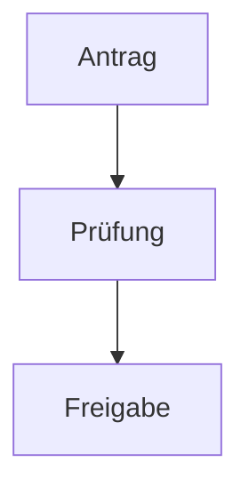

# Meeting Recorder

Bot-System für BigBlueButton im Intranet: Bots treten Meeting-Räumen bei,
zeichnen Audio auf, transkribieren per Whisper und erstellen KI-Zusammenfassungen
(vLLM/Qwen). Verwaltung komplett über eine Weboberfläche mit
Active-Directory-Anmeldung.

## Architektur

```
frontend/   React + Redux Toolkit (TypeScript, Vite), wird ins Backend gebaut
backend/    Spring Boot 3 (Java 21), Playwright-Bot-Engine, PostgreSQL;
            liefert zugleich das gebaute Frontend als statische Ressourcen aus
docs/       Anleitungen (u.a. Whisper-Diarisierung), Alt-Dokumentation
```

- **Bot-Engine**: Jeder Bot ist eine eigene Headless-Chromium-Instanz
  (Playwright). Der Join erfolgt UI-basiert über die fertige Raum-URL —
  bewusst ohne BBB-API/Checksums, weil die Intranet-Umgebung (Nextcloud-
  BBB-Integration) so angebunden ist. Audio wird im Browser per WebAudio +
  MediaRecorder gemischt und segmentweise ins Backend gestreamt.
- **Steuerung**: über das Frontend (Raum-URL eingeben, Aufnahme
  starten/stoppen) und weiterhin per Chat-Befehl im Meeting
  (`STARTRECORDING`/`STOPRECORDING`, Zwei-Marker-System gegen Selbst-Trigger).
  Eigene Nachrichten des Bots wertet er nie als Befehl aus, und sie landen nicht
  im Chat-Protokoll der Aufnahme.
- **Anonymer Stopp-Link** (Admin-Schalter `bot.anonymousStopEnabled`, Standard
  aus): Der Aufnahme-Hinweis im Chat enthält zusätzlich einen einmaligen Link.
  Darüber kann ein Teilnehmer die Aufnahme verwerfen und den Bot aus dem Raum
  schicken, ohne sich im Chat als „Spielverderber“ zu erkennen zu geben
  (siehe [Anonymer Stopp-Link](#anonymer-stopp-link)).
- **Bot-Vorlagen**: Ein regelmäßig aufgezeichneter Raum muss nicht jedes Mal neu
  eingetragen werden. Im Tab **Bots** speichert jeder Nutzer benannte Vorlagen
  (Meeting-URL, Bot-Name, Aufnahme- und Auswertungsschalter, Sprache der
  Aufnahme, Auswertungs-Vorlage); danach genügt "Bot starten" an der Vorlage.
  Mit einem **Zeitplan** (z.B. Mo/Mi/Fr 09:00–10:00) tritt der Bot sogar selbst
  bei und verlässt den Raum zur Endzeit. Alternativ lässt sich
  eine Vorlage ins Startformular übernehmen, wenn einmal etwas abweichen soll.
  Die Vorlagen sind **benutzerbezogen** — in der Meeting-URL steckt der Zugang
  zum Raum, deshalb sieht sie niemand außer dem Besitzer (`/api/bot-templates`).
- **Verarbeitung**: STT (Whisper) → **KI-Glättung des Transkripts** →
  Zusammenfassung (LLM), als Jobs in einem Admin-definierten Zeitfenster
  (Standard 20:00–06:00), damit die GPU tagsüber frei bleibt. Pro Aufnahme gibt
  es einen "Jetzt auswerten"-Knopf für die Sofort-Verarbeitung.
- **Transkript-Glättung & Glossar**: Vor der Auswertung glättet das LLM das
  Rohtranskript (Füllwörter, Satzzeichen, Erkennungsfehler). Das Original bleibt
  erhalten — im Transkript-Tab lässt sich zwischen **Korrigiert** und **Original**
  umschalten. Unter **Glossar** pflegt jeder Nutzer eigene Abkürzungen und
  Fachbegriffe; daneben steht ein **gemeinsames Glossar der Installation**, das
  Admins pflegen und alle lesen. Beide gehen in die Glättung ein.
- **Beigefügte Unterlagen**: Zu einer Aufnahme lassen sich **Tagesordnung, Folien
  oder Papiere** hochladen (PDF, Office, Markdown, Text, Bilder). Ihr Text geht in
  die KI-Auswertung ein, damit die Zusammenfassung das Thema kennt. PDF, Office und
  gescannte Seiten (OCR) übernimmt ein **Apache-Tika-Server**.
- **Fassungen der Zusammenfassung**: Eine erneute Auswertung ersetzt die
  vorhandene Zusammenfassung nicht, sondern legt eine weitere Fassung daneben —
  beschriftet mit Vorlage, Modell und Zeitpunkt. Im Reiter lässt sich zwischen
  ihnen umschalten; eine ist die aktuelle (Download, API, Freigabe), ältere
  lassen sich wieder nach vorn holen oder löschen. **Modell und Temperatur**
  lassen sich je Vorlage und je Aufnahme überschreiben — so lassen sich zwei
  Modelle an derselben Aufnahme vergleichen.
- **Vorlagen**: Im Tab **Vorlagen** pflegt jeder Nutzer eigene
  Auswertungs-Prompts (Liste links, großer Editor rechts; integrierte Vorlagen
  für Meeting, Vortrag, Interview und Sprachnotiz lassen sich als Kopie öffnen,
  die Admin-Vorgabe als Ausgangspunkt übernehmen). Die gespeicherten Vorlagen stehen
  anschließend unter "Auswertung anpassen" und im Upload-Dialog zur Auswahl
  (`/api/prompt-templates`); jede Vorlage darf ein eigenes **Modell** und eine
  eigene **Temperatur** mitbringen.
- **Verwaltung**: Aufnahmen anhören (Streaming), herunterladen, löschen,
  mit Nutzern und selbst erstellten Gruppen teilen — oder per **Freigabe-Link**
  weitergeben, entweder kontogebunden (Empfänger meldet sich an und bekommt die
  Freigabe automatisch) oder ohne Anmeldung (siehe unten). Admins pflegen
  Einstellungen (Whisper-/LLM-Parameter, Zeitfenster, Bot-Verhalten) und
  Admin-Rollen im Frontend.
- **Läuft die Verarbeitung?**: Der Admin-Tab **Verarbeitung** zeigt die
  Warteschlange — was wartet, was läuft, die letzten Fehlschläge mit Grund, die
  Dauer der einzelnen Schritte und ob das nächtliche Zeitfenster gerade offen
  ist. Gescheiterte Aufträge lassen sich von dort erneut anstoßen.
- **Wer ist aktiv?**: Der Admin-Tab **Benutzer** zeigt je Konto, ob es gerade
  angemeldet ist und ob dafür eine **Aufnahme läuft** (mit Quelle und Laufzeit);
  laufende Aufnahmen stehen zusätzlich als Warnung über der Liste. So lässt sich
  vor einem Neustart oder einer Wartung sehen, wen das mitten in einer Aufnahme
  träfe. Die Anmeldung ist zustandslos (JWT), deshalb zählt die letzte Anfrage
  aus dem Frontend (`app_user.last_seen_at`, gedrosselt fortgeschrieben);
  „angemeldet" heißt Aktivität in den letzten 5 Minuten, API-Schlüssel-Zugriffe
  bleiben unberücksichtigt.
- **Datei-Upload**: Bestehende Audio-/Videodateien (MP3, WAV, M4A, MP4, …)
  lassen sich über "Aufnahme hochladen" als Aufnahme importieren
  (`POST /api/recordings/upload`). Die Datei wird serverseitig per ffmpeg zu
  einem MP3-Segment umgewandelt (bei Video wird die Tonspur extrahiert) und
  durchläuft danach dieselbe Auswertung wie Bot-Aufnahmen (Whisper + LLM,
  optional sofort statt im Nacht-Zeitfenster). Die **Auswertungs-Vorlage** und die
  **Sprache der Aufnahme** lassen sich schon im Upload-Dialog wählen (Vorlage:
  Meeting, Vortrag, Interview, Sprachnotiz oder eine eigene) — sonst liefe eine
  Sofort-Auswertung mit den Vorgaben des Administrators, bevor man sie
  nachträglich ändern könnte.
- **Schlagworte & Suche**: Aufnahmen lassen sich mit Schlagworten versehen
  (der Besitzer pflegt sie, alle mit Leseberechtigung sehen und filtern danach).
  Das Suchfeld über der Liste durchsucht Titel/Raumname, Meeting-URL und
  Schlagworte; auf Wunsch zusätzlich **Transkript und Zusammenfassung**
  (`GET /api/recordings?q=…&tag=…&content=true`).
- **Bildschirmaufnahme**: "Bildschirm aufnehmen" zeichnet Bildschirm/Fenster/Tab
  samt Systemton und optionalem Mikrofon direkt im Browser des Nutzers auf und
  überträgt die laufende Aufnahme stückweise an den Server
  (`/api/recordings/capture/*`), wo sie in dieselbe Verarbeitung wie ein Upload
  läuft. **Setzt HTTPS voraus** und funktioniert nur in Chrome/Edge —
  Einrichtung (inkl. Reverse-Proxy-Konfiguration) und Grenzen:
  [docs/SCREEN_CAPTURE.md](docs/SCREEN_CAPTURE.md)

## Schnellstart (Docker Compose)

Secrets (DB-Passwort, JWT-Secret, Admin-Passwort) stehen in einer lokalen
`.env` (nicht in Git); der Rest steht in `docker-compose.yml`. Das App-Image
wird fertig aus der Registry bezogen (kein lokaler Build):

```bash
cp .env.example .env       # DB_PASSWORD / JWT_SECRET / ADMIN_INITIAL_PASSWORD eintragen
docker compose pull        # fertiges Image holen/aktualisieren
docker compose up -d
# Weboberfläche (UI + API im selben Container): http://<host>:8090
```

Im Betrieb steht davor ein Reverse Proxy mit TLS. Das ist keine reine
Härtungsmaßnahme: Die **Bildschirmaufnahme funktioniert ausschließlich über
HTTPS**, weil der Browser die nötigen Schnittstellen sonst gar nicht bereitstellt.
Fertige nginx-/Apache-Konfigurationen stehen in
[docs/SCREEN_CAPTURE.md](docs/SCREEN_CAPTURE.md#reverse-proxy-einrichten);
das Backend wertet die `X-Forwarded-*`-Header bereits aus
(`server.forward-headers-strategy: framework`).

`docker compose` liest `.env` automatisch. Fehlt eine Pflicht-Variable,
bricht der Start mit einer klaren Meldung ab — statt still mit einem
Default-Secret zu laufen.

Das Image selbst wird mit `./scripts/docker-push.sh` gebaut und gepusht.

Der erste Admin wird über `BOOTSTRAP_ADMINS` (AD-Benutzername) bestimmt und
kann weitere Admins im Frontend ernennen.

## Entwicklung

```bash
# Backend (braucht PostgreSQL, z.B. docker compose up -d db)
cd backend
AUTH_MODE=dev mvn spring-boot:run     # Login: admin/admin bzw. user/user

# Frontend (Dev-Server mit Proxy auf localhost:8080)
cd frontend
npm install && npm run dev
```

Tests: `cd backend && mvn test`

### Migrationen gegen echtes PostgreSQL prüfen

`MigrationSchemaIT` spielt alle Flyway-Migrationen ein und lässt Hibernate das
Ergebnis gegen die Entitäten prüfen (`ddl-auto=validate`) — damit fällt eine
Migration auf, die nicht zum Mapping passt, vor dem Ausrollen auf. Der Test ist
standardmäßig deaktiviert, weil er eine **leere Wegwerf-Datenbank** braucht (die
Migrationen laufen scharf); H2 kommt nicht in Frage, weil die bestehenden
Migrationen Postgres-Syntax nutzen und ihre Prüfsummen sich nicht mehr ändern
dürfen:

```bash
docker exec bbbbot-dev-db psql -U bbbbot -d postgres -c 'CREATE DATABASE bbbbot_migtest'
cd backend
mvn test -Dtest=MigrationSchemaIT \
  -Ddb.it.url=jdbc:postgresql://127.0.0.1:5433/bbbbot_migtest \
  -Ddb.it.user=bbbbot -Ddb.it.password=...
docker exec bbbbot-dev-db psql -U bbbbot -d postgres -c 'DROP DATABASE bbbbot_migtest'
```

### Textextraktion gegen einen echten Tika-Server prüfen

`TikaClientIT` prüft die Verständigung mit einem echten Tika-Server (Kopfzeilen,
Antwortformat, Fehlerfälle) an einer Textdatei, einer HTML-Seite, einer PDF und
einer DOCX — die Testdateien entstehen im Test, es liegt keine Binärdatei im
Repository. Standardmäßig deaktiviert, weil ein Server nötig ist:

```bash
docker run -d --name tika-test -p 9998:9998 apache/tika:latest
cd backend
mvn test -Dtest=TikaClientIT -Dtika.it.url=http://localhost:9998
docker rm -f tika-test
```

OCR ist dort bewusst nicht dabei: Sie hängt daran, ob im Tika-Server tesseract
samt Sprachpaket steckt (`apache/tika:latest-full`), und ein Test, der je nach
Image durchfällt, sagt nichts über diesen Code.

### Live-Integrationstests (echter BBB-Raum)

Die Tests unter `backend/src/test/java/bbbbot/it/` fahren den kompletten
Bot-Flow (Join, Audio-Auswahl, Chat, Teilnehmerliste, Aufnahme) gegen einen
echten Raum. Sie sind standardmäßig deaktiviert und laufen nur, wenn eine
Raum-URL übergeben wird:

```bash
cd backend
# Schritt-für-Schritt-Diagnose mit Screenshots/DOM-Dumps (target/it-diag/)
mvn test -Dtest=LiveRoomJoinDiagnosticsTest -Dbbb.it.url="https://.../apps/bbb/b/XYZ"

# Alle Bot-Funktionen End-to-End (Chat, Teilnehmer, Recorder, Modals)
mvn test -Dtest=LiveRoomFunctionsTest -Dbbb.it.url="https://.../apps/bbb/b/XYZ"
```

Optional: `-Dbbb.it.name=MeinBot` setzt den Anzeigenamen (Standard
`RecorderBot-IT`). Screenshots, DOM-Inventare und Browser-Konsole jedes Laufs
liegen danach unter `backend/target/it-diag/`.

Für den Datei-Upload gibt es zusätzlich einen UI-Smoke-Test gegen ein
laufendes Backend + Frontend (Login → Dialog → Upload → Listeneintrag):

```bash
mvn test -Dtest=UiUploadSmokeTest -Dui.it.url="http://localhost:5173" \
  -Dui.it.user=admin -Dui.it.password="..." -Dui.it.file=/pfad/zur/datei.mp3
```

## Wichtige Umgebungsvariablen (Backend)

| Variable | Bedeutung |
|---|---|
| `DB_URL`, `DB_USER`, `DB_PASSWORD` | PostgreSQL-Verbindung |
| `AUTH_MODE` | `ldap` (Active Directory) oder `dev` (lokale Testnutzer) |
| `AD_DOMAIN`, `AD_URL`, `AD_ROOT_DN` | Active-Directory-Anbindung |
| `BOOTSTRAP_ADMINS` | Nutzer, die beim ersten Login Admin werden |
| `JWT_SECRET` | Signaturschlüssel für Sessions (min. 32 Zeichen) |
| `JWT_TTL_HOURS` | Login-Session-Dauer in Stunden (Standard 168 = 7 Tage) |
| `MAX_CONCURRENT_BOTS` | Obergrenze paralleler Bots (Standard 5) |
| `CHROME_PATH` | Optionaler Pfad zu einem System-Chromium |
| `INSECURE_TLS` | `true`: Self-Signed-Zertifikate akzeptieren (Intranet) |
| `STORAGE_DIR` | Ablage für Aufnahmen/Transkripte/Zusammenfassungen/beigefügte Unterlagen |

Alle fachlichen Parameter (Whisper-URL und -Parameter, LLM-Endpunkt/Modell,
Zeitfenster, Segmentlänge, Chat-Befehle, Reconnect-Verhalten, …) werden zur
Laufzeit im Frontend unter **Admin → Einstellungen** gepflegt und in der
Datenbank gespeichert.

## Nutzerführung einer noch nicht ausgewerteten Aufnahme

Bei einer Aufnahme, die noch kein Transkript und keine Zusammenfassung hat, stand
der Zustand früher an vier Stellen verteilt: Status-Badge im Kopf, Knöpfe in der
Aktionsleiste, ein Hinweistext im Tab „Zusammenfassung" und die Job-Tabelle im
letzten Tab. Was als **Nächstes** passiert, stand nirgends zusammenhängend.

Zwei Bausteine beantworten das jetzt:

**Die Fortschrittskette** im Kopf der Aufnahme: **Aufnahme → Transkript →
Zusammenfassung**, je Stufe erledigt / läuft / eingeplant / gescheitert /
entfällt / offen. Drei Stufen und nicht vier — die Transkript-Glättung ist ein
Zwischenschritt, den der Nutzer nicht steuert und dessen Ausfall die Auswertung
nicht stoppt. Der Zustand steht als Zeichen **und** als Wort an jeder Stufe;
Farbe allein wäre für Farbfehlsichtige keine Information.

**Die Box „Wie geht es weiter?"** direkt darunter: Sie sagt in Klartext, was der
Zustand ist und was als Nächstes geschieht — von allein oder auf Klick — und
bietet **genau einen** primären Knopf. Ein zweiter Weg steht als Textlink
daneben, nicht als gleichrangiger Knopf. Läuft gerade etwas, gibt es keinen
Knopf, sondern den Zustand und die Laufzeit („läuft seit 4 Min.").

Bewusst **keine Restzeitschätzung**: Die Verarbeitungsdauer skaliert mit der
Audiolänge, und der Median über alle Aufnahmen mischt die Sprachnotiz mit der
Vorstandssitzung. Eine falsche Zusage wäre schlechter als keine.

Die Box deckt zehn Zustände ab, darunter drei, die vorher in eine Sackgasse
liefen:

- **Wartet auf das Zeitfenster** — mit **Uhrzeit**. Vorher stand dort nur
  „nächtliches Zeitfenster"; die Zeiten waren ausschließlich für Admins lesbar.
  Dafür gibt es jetzt `GET /api/recordings/processing-info` (für jeden
  angemeldeten Nutzer: `windowStart`, `windowEnd`, `windowOpen`).
- **Fertig, aber KI-Analyse war abgewählt** — die Aufnahme springt in diesem Fall
  direkt auf `DONE`, es gibt nie einen Auftrag. Vorher stand dort nur „Keine
  Zusammenfassung vorhanden."; jetzt der Grund und der Weg, sie nachzuholen.
- **Fertig, aber zu wenig Inhalt** — der Auftrag war *erfolgreich* und hat
  bewusst nichts erzeugt. Der Grund stand nur in der Job-Tabelle.

Die Zuordnung Zustand → Text → Knopf liegt als reine Funktion in
`frontend/src/pages/recordingProgress.ts`, getrennt von der Darstellung. Zehn
Zustände über JSX verteilt wären nicht prüfbar; so lässt sich die Tabelle lesen
und ändern, ohne durch Komponenten zu suchen.

Nebenbei: Die **Segmentliste** ist eingeklappt, sobald ein Transkript existiert.
Ohne Transkript bleibt sie offen — dann ist sie der einzige Weg, die Aufnahme
anzuhören.

## Verarbeitungs-Warteschlange im Blick (Admin-Tab „Verarbeitung")

Bei einer GPU, einem nächtlichen Zeitfenster und mehreren Bots entscheidet sich
in der Warteschlange, ob morgens alles fertig ist. Bisher waren Jobs nur pro
Aufnahme sichtbar (Detailseite → Verarbeitung) — bleibt die Schlange stehen,
weil Whisper nicht erreichbar ist, merkte es niemand.

Der Tab **Admin → Verarbeitung** ist die Seite, die man morgens aufschlägt:

- **Zeitfenster** ganz oben: offen oder geschlossen, mit den konfigurierten
  Zeiten — und wie viele Aufträge nur darauf warten. Das ist die Antwort auf die
  häufigste Rückfrage „warum läuft nichts?".
- **Kennzahlen**: wartet / läuft / gescheitert / fertig.
- **Warteschlange**: wartende und laufende Aufträge mit Aufnahme, Aufgabe
  (volle Auswertung, nur Transkription, erneute Auswertung, erneute
  Transkription), Versuch („2 von 3") und **Wartezeit**. Wartezeit heißt „bis
  zum Start" — was danach kommt, ist Laufzeit.
- **Letzte Fehlschläge** mit dem Grund aus `processing_job.last_error` und einem
  Knopf **Erneut versuchen**. Er setzt den Versuchszähler zurück (sonst bliebe
  ein Auftrag mit verbrauchten Versuchen dauerhaft stehen — genau dafür ist der
  Knopf da) und stößt den Auftrag **sofort** an: Wer morgens drückt, hat die
  Ursache behoben und will das Ergebnis heute.
- **Dauer der Schritte**: Median und Maximum der letzten 50 fertigen Aufträge,
  aufgeschlüsselt nach Spracherkennung, Glättung und Zusammenfassung. Der
  Median statt des Mittelwerts, damit eine einzelne dreistündige Aufnahme das
  Bild nicht verschiebt; das Maximum daneben, weil genau der Ausreißer
  interessiert.

Die Ansicht lädt sich alle 10 Sekunden nach, solange der Tab offen ist.

Für die **Dauer je Schritt** waren die Daten noch nicht da: Bisher ließ sich nur
die Gesamtdauer errechnen. Ob Whisper langsam war oder das LLM, sind aber zwei
verschiedene Baustellen — ein anderes Whisper-Modell hilft nicht gegen ein
überlastetes LLM. Die Verarbeitung misst die Schritte deshalb jetzt mit
(`processing_job.stt_ms`, `correction_ms`, `summary_ms`, Migration V27). `NULL`
heißt „dieser Schritt lief in diesem Auftrag nicht"; nach einem Fehlschlag
gelten die Werte des laufenden Versuchs, nicht die des vorigen.

Per API: `GET /api/admin/processing` und
`POST /api/admin/processing/jobs/{jobId}/retry` (beide nur mit Admin-Recht).

## Bot-Vorlagen

Wer denselben Meetingraum regelmäßig aufzeichnet, soll ihn nicht jedes Mal neu
eintragen. Im Tab **Bots** steht über dem Startformular der Abschnitt
**Bot-Vorlagen**: Eine Vorlage hält Name, Meeting-URL, Bot-Name, die Schalter
für Aufnahme und Auswertung (automatisch aufnehmen, Video, KI-Analyse,
Sprechererkennung) und die Sprache der Aufnahme — also genau die Angaben, die
`POST /api/bots` erwartet. Danach genügt an der Vorlage **Bot starten**.

Drei Wege führen zu einer Vorlage: **Neue Vorlage** (leeres Formular),
**Als Vorlage speichern** unter dem Startformular (übernimmt, was gerade
eingetragen ist) und **Bearbeiten** an einer bestehenden. Umgekehrt holt
**Ins Formular** eine Vorlage ins Startformular zurück, wenn für diesen einen
Termin etwas abweichen soll.

**Vorlagen sind benutzerbezogen.** In der Meeting-URL steckt der Zugang zum
Raum, deshalb sieht eine Vorlage nur ihr Besitzer — auch Admins bekommen unter
`/api/bot-templates` ausschließlich ihre eigenen. Namen sind pro Nutzer
eindeutig (case-insensitive, DB-seitig über `uq_bot_template_owner_name`); zwei
Nutzer dürfen denselben Namen verwenden.

Gestartet wird über `POST /api/bots/from-template/{id}` — der Server liest die
Vorlage selbst (dieselbe Logik nutzt der Zeitplan). Damit eine Vorlage nicht erst beim Starten scheitert, prüfen Vorlage
und Sofort-Start dieselben Regeln: `http(s)://` am Anfang und die
SSRF-Allowlist `bot.allowedUrlHosts`. Die **Sprechererkennung** ist die eine
Ausnahme: Sie wird in der Vorlage als Wunsch gespeichert, auch wenn der Admin
sie gerade gesperrt hat (`whisper.diarize`) — sonst verliert die Vorlage die
Einstellung, nur weil sie während einer Sperre gespeichert wurde. Über die
Ausführung entscheidet der Start.

### Auswertungs-Vorlage

Jede Bot-Vorlage (und auch das Startformular) wählt, mit welcher
**Auswertungs-Vorlage** die Aufnahmen des Bots im Anschluss ausgewertet werden —
dieselbe Auswahl wie beim Upload: „Meeting (Standard)" (folgt der Vorgabe des
Admins), eine integrierte Vorlage (Meeting, Vortrag, Interview, Sprachnotiz) oder
eine eigene Promptvorlage samt Modell und Temperatur. Die Wahl wandert über die
Bot-Session an jede Aufnahme, bevor der Verarbeitungs-Job entsteht; schon die
erste (auch sofortige) Auswertung läuft also mit ihr. Eine eigene Promptvorlage
wird bei jedem Start frisch gelesen (`summary_preset = tpl:<id>`), Änderungen
daran wirken sofort. Ist sie inzwischen gelöscht, bleibt der beim Speichern
festgehaltene Stand in Kraft.

### Zeitplan

Optional trägt eine Vorlage einen **Zeitplan**: Wochentage plus Start- und
Endzeit, z.B. *Mo, Mi, Fr 09:00–10:00*. Der `BotScheduler` prüft alle 30 s
(`bbbbot.bots.schedule-check-ms`), tritt zu Beginn eines Termins selbst bei und
schickt den Bot zur Endzeit aus dem Raum — die laufende Aufnahme wird dabei
regulär abgeschlossen und ausgewertet.

- **Zeitzone**: Die Uhrzeiten gelten in der Zeitzone, die beim Speichern aus dem
  Browser kommt (z.B. `Europe/Berlin`), nicht in der des Containers (oft UTC).
  Sommer-/Winterzeit wird berücksichtigt. Liegt die Endzeit vor der Startzeit,
  endet der Termin am Folgetag.
- **Ein Bot pro Termin**: Ob für einen Termin schon ein Bot lief, steht in den
  Bot-Sessions (`bot_session.bot_template_id` + Startzeit) — das übersteht auch
  einen Neustart des Servers. Scheitert der Beitritt (Session `FAILED`, z.B.
  Raum noch nicht geöffnet oder Server neu gestartet), versucht es der
  Scheduler nach 2 Minuten erneut, höchstens 5 Mal pro Termin. Wer den Bot von
  Hand beendet (`STOPPED`), bekommt ihn in diesem Termin nicht zurück.
- **Belegte Plätze**: Sind alle Bot-Plätze belegt, versucht es der Scheduler bei
  jedem Durchlauf erneut; nimmt schon ein anderer Bot den Raum auf, startet
  keiner zusätzlich.
- **Start von Hand im Termin**: Wird eine Vorlage während eines laufenden Termins
  per „Bot starten" gestartet, gilt das als dieser Termin — der Bot verlässt den
  Raum zur geplanten Endzeit, und der Scheduler startet keinen zweiten.
- Ein **pausierter** Zeitplan behält Tage und Zeiten, damit er nach den Ferien
  nur wieder eingeschaltet werden muss.

## Anonymer Stopp-Link

Wer eine Aufnahme nicht möchte, muss dafür bisher `STOPRECORDING` in den Chat
schreiben – vor allen anderen. Mit dem Stopp-Link geht das unauffällig:

1. Beim Aufnahmestart hängt der Bot an seinen Hinweis einen Link
   `<Adresse der Anwendung>/stop/<token>`. Die Adresse ergibt sich wie bei
   Freigabe-Links automatisch: aus dem `Origin` der Browser-Anfrage, die den Bot
   gestartet hat, bzw. – bei Starts nach Zeitplan – aus der Adresse, unter der die
   Vorlage zuletzt gespeichert wurde (`bot_template.app_origin`, V29). Nur wenn
   Teilnehmer die Anwendung unter einer anderen Adresse erreichen als die Nutzer,
   trägt der Admin eine feste Adresse in `bot.publicUrl` ein. Die Stelle bestimmt der Platzhalter
   `${STOP_URL}` in `bot.warnMessage`; fehlt er, wird der Link als eigener Satz
   angehängt.
2. Die Seite hinter dem Link braucht keine Anmeldung und zeigt nur den Raumnamen
   und einen Button „Aufnahme beenden und verwerfen“ samt Rückfrage.
3. Nach der Bestätigung wird die Aufnahme verworfen (Dateien gelöscht, auch ein
   Video), der Bot schreibt die neutrale Nachricht „Die Aufnahme wurde beendet
   und verworfen. Der Bot verlässt jetzt den Raum.“ und geht. Beim Besitzer steht
   an der Aufnahme nur „Durch einen Teilnehmer beendet“.

Eigenschaften:

- **Nur der Klick zählt**: `GET /api/public/bot-stop/{token}` zeigt nur den
  Raumnamen, erst `POST` beendet. Link-Vorschauen und Virenscanner, die Links
  vorab abrufen, lösen also nichts aus.
- **Einmalig und kurzlebig**: 256-Bit-Zufallstoken, gilt nur für die laufende
  Aufnahme und nur einmal; jede neue Aufnahme bekommt einen neuen Link. Der Bot
  hält nur den SHA-256-Hash im Arbeitsspeicher – nach einem Server-Neustart sind
  alle Links ungültig.
- **Anonym**: Über den Aufrufer wird nichts gespeichert oder geloggt. Jeder
  ungültige Fall (unbekannt, verbraucht, abgelaufen, Funktion aus) liefert
  dieselbe 404.
- **Admin-Schalter wirkt sofort**: Wird `bot.anonymousStopEnabled` abgeschaltet,
  sind auch bereits verschickte Links wirkungslos.
- **Voraussetzungen**: nur `bot.sendChatWarning = true`. Vorlagen mit Zeitplan,
  die vor dieser Version gespeichert wurden, kennen ihre Adresse noch nicht –
  einmal öffnen und speichern, dann bekommen auch ihre Bots den Link. Teilnehmer, die die
  Anwendung nicht erreichen (z.B. externe Gäste), sehen einen toten Link.
- Bei einem Zeitplan zählt der Stopp wie ein Beenden von Hand: Der Bot kommt im
  laufenden Termin nicht zurück, im nächsten schon.

## Sprache der Oberfläche

Die Weboberfläche gibt es auf **Deutsch und Englisch**. Jeder Nutzer stellt seine
Sprache selbst über die Auswahl in der Kopfzeile ein (auf dem Anmeldebildschirm
ebenfalls, damit die Anmeldung nicht in einer fremden Sprache erscheint). Die Wahl
wird **am Konto** gespeichert (`app_user.language`, `PUT /api/users/me/language`)
und gilt damit auf jedem Gerät; zusätzlich merkt sie der Browser lokal für den
Anmeldebildschirm. Ohne gespeicherte Wahl entscheidet die Browsersprache,
Rückfall ist Deutsch.

Umgesetzt ohne i18n-Bibliothek (`frontend/src/i18n/`): In den abgeschotteten
Zielnetzen muss jede neue npm-Abhängigkeit erst durch den internen Mirror – für
zwei Wörterbücher und eine Ersetzungsfunktion lohnt das nicht. `de.ts` ist die
Quelle der Wahrheit, `en.ts` ist als `typeof de` typisiert: **Eine fehlende
Übersetzung ist ein Compile-Fehler**, keine stille Lücke. Auch die Schlüssel selbst
sind typisiert, ein Tippfehler fällt beim Bauen auf. Eine weitere Sprache
hinzufügen heißt: Wörterbuch anlegen, in `LANGUAGES` (i18n) und
`SUPPORTED_LANGUAGES` (`UserController`) eintragen.

Übersetzt sind alle Seiten, Dialoge und Meldungen der Oberfläche – auch die
Hilfetexte im Admin-Bereich und die integrierten Auswertungs-Prompts. Nicht
übersetzt sind Texte, die **vom Server** kommen (Validierungsmeldungen,
Verwurfsgründe) sowie fachliche Inhalte wie Transkripte und Zusammenfassungen
(Sprache der Aufnahme und Sprache der Zusammenfassung werden pro Aufnahme
separat eingestellt, siehe unten).

## Sprache der Aufnahme (Spracherkennung)

Welche Sprache gesprochen wird, entscheidet **pro Aufnahme** der Nutzer:
wählbar im Upload-Dialog, im Bot-Formular, beim Start einer Bildschirmaufnahme
und nachträglich unter „Auswertung anpassen" (`recording.stt_language`,
`POST /api/recordings/{id}/summary-options`). Über die API nehmen
`POST /api/recordings/upload`, `POST /api/bots`,
`POST /api/recordings/capture/start` und `POST /api/transcriptions` denselben
Parameter `sttLanguage` entgegen.
Zur Wahl stehen gängige Sprachen sowie **automatisch erkennen** — dann bekommt
Whisper gar keine Sprachvorgabe und entscheidet selbst. Ohne Wahl gilt der
Admin-Standard `whisper.language`; ist der leer, wird ebenfalls automatisch
erkannt.

Der Grund für die Wahl an der Aufnahme: Ein falscher Sprach-Hinweis beschädigt
das Transkript an der Wurzel — Glättung und Zusammenfassung bauen darauf auf und
können es nicht mehr retten. Deshalb steht die Wahl schon **vor** der ersten
Transkription zur Verfügung; für eine bereits transkribierte Aufnahme wirkt eine
Änderung erst über „Transkription neu erstellen".

Die Sprache der **Zusammenfassung** ist davon unabhängig (ebenfalls unter
„Auswertung anpassen") — ein englischer Vortrag lässt sich also mit englischer
Spracherkennung und deutscher Zusammenfassung auswerten.

## Transkript-Glättung und Glossar

Zwischen Spracherkennung und Auswertung liegt ein Glättungsschritt: Das LLM
bereinigt das Rohtranskript um Füllwörter und Wiederholungen, setzt Satzzeichen
und korrigiert offensichtliche Erkennungsfehler. Die Zusammenfassung arbeitet
danach mit der geglätteten Fassung; **das Original bleibt gespeichert** und ist im
Transkript-Tab über den Umschalter *Korrigiert / Original* jederzeit einsehbar
(Dateien: `transcript.md` = geglättet, `transcript_original.md` = Rohfassung).

**Geglättet wird satzweise, in mehreren Schritten.** Whisper liefert
Zeitstempel-Zeilen, die häufig mitten im Satz enden („und dann haben wir" /
„das Thema verschoben") — ein solches Fragment isoliert zu glätten kann nicht gut
werden. Deshalb werden aufeinanderfolgende Zeilen zu **ganzen Sätzen**
zusammengefasst, und erst die gehen ans Modell. Ein Satz wird auch nie über zwei
Schritte zerschnitten: Die Schrittgröße (`correction.chunkChars`) ist eine
Obergrenze, die an Satzgrenzen eingehalten wird. Ein Sprecherwechsel beendet
immer einen Satz, damit Aussagen zweier Personen nicht verschmelzen. Der
geglättete Satz trägt den Zeitstempel seiner ersten Zeile; die geglättete Fassung
liest sich dadurch in ganzen Sätzen, das Original behält die feine Zeitauflösung.

**Wie die Struktur erhalten bleibt:** Zeitstempel (`[12:34]`) und Sprecher-Labels
(`SPEAKER_00:`) tragen die gesamte Struktur des Transkripts — ein LLM, das den
ganzen Text umschreibt, verliert oder verschiebt sie zuverlässig. Deshalb bekommt
das Modell **nur die Sätze, nummeriert** (`1 | …`); Zeitstempel und Sprecher setzt
das Backend anschließend selbst wieder davor. Sätze, die in der Antwort fehlen
oder unplausibel sind (leer, unverhältnismäßig lang), bleiben im Original — bei
einem mehrzeiligen Satz alle seine Zeilen. Fällt die Glättung ganz aus (LLM nicht
erreichbar), läuft die Auswertung mit dem Original weiter; der Job schlägt
deswegen nicht fehl.

Unter **Glossar** stehen zwei Listen nebeneinander:

- **Mein Glossar** — die eigenen Abkürzungen, Eigennamen und Fachbegriffe
  (optional mit Bedeutung).
- **Gemeinsames Glossar** — Begriffe der ganzen Installation: Abteilungskürzel,
  Projekt- und Produktnamen. Gepflegt wird die Liste von **Admins**, lesen und
  exportieren dürfen sie alle. So muss nicht jeder dieselbe Liste selbst pflegen,
  und die Qualität eines Transkripts hängt nicht davon ab, wer den Bot gestartet
  hat.

Bei einer Aufnahme gehen **beide** in den Glättungs-Prompt ein: das gemeinsame
Glossar und das persönliche ihres **Besitzers**. Steht ein Begriff in beiden,
gewinnt der persönliche Eintrag — wer einen Begriff selbst pflegt, meint damit
etwas Genaueres als die installationsweite Liste. Die Obergrenze
`correction.glossaryMaxChars` gilt für das zusammengeführte Ergebnis.

Beide Listen lassen sich als **CSV-Datei** herunterladen und wieder einlesen
(`GET /api/glossary/export`, `POST /api/glossary/import`; gemeinsam unter
`/api/glossary/shared/export` bzw. `/api/glossary/shared/import`) — so kann eine
Liste vorab in Excel oder im Texteditor vorbereitet und gepflegt werden:

```
Begriff;Bedeutung
BBB;BigBlueButton, unser Videokonferenzsystem
STT;"Speech-to-Text; Spracherkennung"
Jour Fixe
```

Semikolon als Trennzeichen und UTF-8 mit BOM, damit Excel die Datei ohne
Nachfrage richtig öffnet. Der Import **führt zusammen**: vorhandene Begriffe
werden mit der Bedeutung aus der Datei aktualisiert, neue angelegt, nicht
genannte bleiben unberührt — gelöscht wird nie. Beim Lesen sind Kopfzeile,
`#`-Kommentarzeilen, Komma/Tabulator als Trennzeichen und Windows-1252-Dateien
zulässig; das Ergebnis nennt Zahlen und Hinweise mit Zeilennummer (z.B.
doppelte Begriffe, Zeilen ohne Begriff). Ein Export bei leerem Glossar liefert
die Kopfzeile allein und dient damit als Vorlage.

Einstellungen (Admin → Einstellungen → *Transkript-Glättung*):

| Schlüssel | Standard | Bedeutung |
|---|---|---|
| `correction.enabled` | `true` | Glättung ein/aus |
| `correction.systemPrompt` | (deutscher Standardprompt) | Anweisung an das LLM; das Antwortformat `Nummer \| Satz` muss erhalten bleiben |
| `correction.chunkChars` | `3000` | Zeichen je Glättungsschritt (ein LLM-Aufruf). Das Antwort-Token-Budget richtet sich nach der **tatsächlichen** Blockgröße (`Zeichen/2 + 512`) und nicht nach `llm.maxTokens` — die Antwort ist etwa so lang wie die Eingabe |
| `correction.maxSentenceChars` | `500` | Notbremse für die Satzbildung: ohne Satzzeichen im Transkript wird nach so vielen Zeichen getrennt |
| `correction.glossaryMaxChars` | `12000` | Wie viel Glossar in den Prompt geht (0 = unbegrenzt) — gemeinsames und persönliches zusammen. Der Block geht in **jeden** Schritt ein und kostet dort Kontext |

Bestehende Aufnahmen bekommen die Glättung über **„Erneut auswerten"** nachträglich.
**„Transkription neu erstellen"** verwirft eine vorhandene Glättung (sie gehört zum
alten Original) und erstellt sie neu. Hinweis zur Laufzeit: Es ist ein LLM-Aufruf
je `chunkChars` Zeichen — eine 80-Minuten-Aufnahme bedeutet bei 3000 gut ein
Dutzend zusätzliche Aufrufe. Für das nächtliche Zeitfenster unproblematisch, bei
„Sofort auswerten" dauert es entsprechend länger.

### Wenn die Glättung in den Timeout läuft

Die Glättung ist der Teil mit den **meisten** LLM-Aufrufen — sie deckt Probleme
auf, die bei einer einzelnen Zusammenfassung je Aufnahme nicht auffallen. Das Log
nennt die Zahlen, an denen sich das festmachen lässt:

```
Segment 0 geglaettet in 12 von 12 Schritt(en) in 47 s (langsamster Schritt 9 s):
  148 Saetze korrigiert, 3 im Original belassen
```

Antwortet das Modell nicht, wird **nach dem ersten erfolglosen Block abgebrochen**
statt jeden weiteren in denselben Timeout zu schicken (bei `llm.timeoutSec` = 300
und zwei Versuchen kostet jeder Block gut zehn Minuten; über alle Blöcke und
Segmente einer Stunde Audio wären das Stunden, in denen die Warteschlange steht).
Die Auswertung läuft danach mit dem Original-Transkript weiter — eine fehlende
Glättung lässt die Zusammenfassung nicht ausfallen. Im Log steht dann eine Zeile
mit den zu prüfenden Stellen.

Reihenfolge beim Suchen:

1. **`llm.timeoutSec`** (Standard 300) gilt für den *ganzen* Aufruf, nicht für
   Leerlauf zwischen Paketen. Ein Block erzeugt bis zu `chunkChars/2 + 512` Tokens
   Ausgabe — bei einem großen Modell unter Last kann das dauern.
2. **`correction.chunkChars`** kleiner setzen (z.B. 1500): kürzere Antworten je
   Aufruf, dafür mehr Aufrufe. Das ist der wirksamste Hebel gegen Timeouts.
3. **`llm.disableThinking`** (Standard `true`) muss an bleiben, wenn ein
   Reasoning-Modell im Spiel ist — siehe unten.
4. **`correction.glossaryMaxChars`**: Das Glossar geht in **jeden** Aufruf ein.
   Ein 12000-Zeichen-Glossar sind grob 4000 Tokens Eingabe pro Block.

### Reasoning-Modelle: `llm.disableThinking`

Modelle wie Qwen3 „denken" vor der Antwort — und dieses Nachdenken läuft **im
selben `max_tokens`-Budget wie die Antwort**. Bei der Glättung reicht das nicht:
Das Modell verbraucht das Budget mit Nachdenken und liefert

```json
"choices":[{"finish_reason":"length","message":{"content":null,"reasoning":"Thinking Process: ..."}}]
```

also gar keine Antwort. Die Zusammenfassung fällt dabei nicht auf, weil sie ein
einziger Aufruf mit kurzer Ausgabe ist; die Glättung macht dutzende.

Deshalb sendet der Client standardmäßig `chat_template_kwargs:
{"enable_thinking": false}` mit (`llm.disableThinking` = `true`). Das ist der
dokumentierte Schalter bei vLLM und llama.cpp für Qwen3-Vorlagen; Server, die ihn
nicht kennen, ignorieren ihn. Kennt euer Server ihn nicht, gibt es zwei Wege:
Nachdenken am Server abschalten (vLLM: `--reasoning-parser` weglassen bzw.
llama.cpp: `--reasoning-budget 0`) oder `llm.disableThinking` auf `false` setzen —
dann bekommt die Glättung zusätzlich `llm.maxTokens` als Reserve für das
Nachdenken. Bleibt trotzdem nichts übrig, steht der Grund jetzt im Klartext im
Log samt `finish_reason` und Länge des Reasonings.

Ein Hinweis zum Modell: Für deutsche Besprechungstexte ist ein **Instruct**-Modell
die bessere Wahl als ein Coder-Modell (`llm.model`).

## Fassungen der Zusammenfassung

Eine erneute Auswertung **ersetzt die Zusammenfassung nicht**, sondern legt eine
weitere **Fassung** daneben. Das hat zwei Gründe: Eine von Hand überarbeitete
Fassung soll ein zweiter Versuch nicht kosten, und ob eine andere Vorlage die
bessere Zusammenfassung liefert, lässt sich nur beurteilen, wenn beide noch da
sind.

Im Reiter **Zusammenfassung** steht dafür über dem Text eine Auswahl der
Fassungen, beschriftet mit **Vorlage, Modell und Zeitpunkt** (und dem Hinweis
*bearbeitet*, wenn Handarbeit darin steckt). Der Prompt, mit dem eine Fassung
entstanden ist, lässt sich pro Fassung aufklappen — er wird an der Fassung
gespeichert, nicht nur an der Aufnahme, weil er sich bis zur nächsten Auswertung
geändert haben kann.

Genau **eine Fassung ist die aktuelle**. Sie ist die eine, die zählt:

- `GET /api/recordings/{id}/summary` und der Download liefern sie,
- die Freigabe-Ansicht zeigt sie,
- `summary.md` im Aufnahme-Verzeichnis enthält sie,
- die Inhaltssuche findet nur in ihr — ein Treffer soll in dem Text stehen, den
  die Aufnahme auch anzeigt.

Die neueste erfolgreiche Auswertung wird automatisch die aktuelle. Über **„Als
aktuelle Fassung"** lässt sich eine ältere wieder nach vorn holen, ohne die neue
zu löschen (`POST /api/recordings/{id}/summaries/{summaryId}/current`). Wird die
aktuelle Fassung gelöscht, übernimmt die neueste verbliebene; ist keine mehr da,
verschwindet auch `summary.md`.

Aufgeräumt wird **nicht automatisch**: Alte Fassungen bleiben, bis jemand sie
löscht. Genau das Automatische wäre der Fehler, den diese Änderung behebt — eine
Aufräumregel würde als erstes die von Hand überarbeitete Fassung treffen. Eine
Fassung ist Text von einigen Kilobyte; wer eine Aufnahme zwanzigmal auswertet,
räumt in der Fassungsliste selbst auf.

Bei Bestandsdaten (Migration V23) wird je Aufnahme die neueste fertige
Zusammenfassung zur aktuellen — also genau die, die vorher überall gezeigt wurde.

### Modell und Temperatur je Vorlage und Aufnahme

`llm.model` und `llm.temperature` sind die **Vorgabe** des Admins. Eine
**Vorlage** darf beides überschreiben (Tab **Vorlagen**), ebenso eine **einzelne
Aufnahme** (**„Auswertung anpassen"**); leer heißt überall „Vorgabe verwenden".
Wird eine Vorlage ausgewählt, bringt sie ihr Modell und ihre Temperatur mit — im
Dialog und schon im Upload-Dialog.

Damit lassen sich **zwei Modelle an derselben Aufnahme** vergleichen: Modell
umstellen, **„Erneut auswerten"**, und die beiden Fassungen stehen anschließend
nebeneinander — beschriftet mit Modell und Temperatur (`Qwen3.5-122B · T 0.3`).
Jede Fassung hält fest, womit sie entstanden ist; die Glättung des Transkripts
bleibt davon unberührt und nutzt weiter die Admin-Vorgabe.

## Beigefügte Unterlagen (Kontext für die Auswertung)

Eine Zusammenfassung wird besser, wenn die KI das Thema kennt und nicht nur das
Gesprochene. Im Reiter **Unterlagen** einer Aufnahme lässt sich deshalb beifügen,
was in der Besprechung durchgesprochen wurde: **Tagesordnung, Folien, Angebote,
Protokolle**. Der Text der Dateien geht in die nächste Auswertung ein — mit
**„Erneut auswerten"** entsteht daraus eine neue Fassung der Zusammenfassung
(siehe oben).

### Woher der Text kommt

| Dateityp | Weg |
|---|---|
| `txt`, `md`, `csv`, `json`, `yaml`, `log`, … | **direkt im Backend** — UTF-8, bei Bedarf Windows-1252 als Rückfall |
| `pdf`, `docx`, `xlsx`, `pptx`, `odt`, `rtf`, `html`, `eml`, … | **Apache Tika** (`documents.tikaUrl`) |
| `png`, `jpg`, `tif`, … und gescannte PDFs | **Apache Tika + tesseract (OCR)** |

Das Backend bringt **keine eigene Textextraktion und keine OCR** mit: Für alles
außer Text-/Markdown-Dateien wird ein **Tika-Server** gebraucht. Das ist Absicht —
Tika deckt Dutzende Formate ab, wird von vielen Häusern ohnehin betrieben, und die
OCR liegt damit dort, wo auch die Sprachpakete liegen. Ist keiner eingerichtet,
scheitert eine PDF mit klarer Meldung statt still leer in der Auswertung zu landen;
der Reiter sagt das vorher. In `docker-compose.yml` steht ein
auskommentierter `tika`-Service als Startpunkt (`apache/tika:latest-full` enthält
tesseract samt gängigen Sprachen).

**OCR** steuert `documents.ocrStrategy`: `auto` (Standard) lässt Tika nur dann
zeichenerkennen, wenn kaum Text im PDF steckt — ein digital erzeugtes PDF braucht
das nicht. Die Sprache (`documents.ocrLanguage`, Standard `deu`) muss als
tesseract-Paket im Tika-Server vorhanden sein. Über **Admin → Einstellungen →
Beigefügte Unterlagen → „Verbindung testen"** lässt sich die Erreichbarkeit prüfen;
ob OCR läuft, zeigt erst ein echter Scan.

Die Extraktion läuft **im Hintergrund** (ein Lauf je Datei, seriell): Ein
mehrseitiger Scan mit OCR braucht Minuten, und so lange darf kein Upload offen
stehen. Die Liste zeigt je Unterlage den Zustand und die **Anzahl erkannter
Zeichen** — daran ist sofort zu sehen, ob wirklich Text herauskam. Eine
gescheiterte Unterlage lässt sich über **„Erneut lesen"** nachziehen, etwa nachdem
Tika oder ein Sprachpaket eingerichtet wurde; neu hochladen muss man sie nicht.

### Was im Prompt landet

Der Unterlagen-Abschnitt geht in **jeden** Auswertungsschritt ein (auch in das
Konsolidieren am Ende), weil der Kontext in Blöcke geschnitten wird und das Thema
in jedem Block bekannt sein muss. Deshalb zwei Obergrenzen — und deshalb kosten
Unterlagen bei einem langen Meeting mehrfach Kontext:

| Schlüssel | Standard | Bedeutung |
|---|---|---|
| `documents.enabled` | `true` | Unterlagen erlaubt. Aus = keine neuen, **und vorhandene gehen nicht mehr in den Prompt ein** (Datenschutz-Notbremse) |
| `documents.maxMegabytes` | `25` | Obergrenze je Datei |
| `documents.tikaUrl` | (leer) | Basis-Adresse des Tika-Servers, z.B. `http://tika:9998`. Leer = nur Text-/Markdown-Dateien |
| `documents.tikaTimeoutSec` | `300` | Zeitlimit je Tika-Anfrage; OCR braucht Minuten |
| `documents.ocrStrategy` | `auto` | `auto`, `no_ocr`, `ocr_only`, `ocr_and_text_extraction` |
| `documents.ocrLanguage` | `deu` | tesseract-Sprachkürzel, z.B. `deu+eng` |
| `documents.maxCharsPerDocument` | `4000` | Zeichen **je Unterlage** im Prompt (0 = unbegrenzt) — ein dickes Handbuch soll die übrigen nicht verdrängen |
| `documents.promptMaxChars` | `12000` | Obergrenze für den **ganzen** Unterlagen-Abschnitt (0 = unbegrenzt) |

Gespeichert wird der **vollständige** extrahierte Text (bis 1 Mio. Zeichen); die
Grenzen wirken nur auf den Prompt. Ein später erhöhtes Limit gilt damit sofort —
ohne eine erneute OCR.

Dem Modell wird im Block ausdrücklich gesagt, dass Unterlagen **kein Gesprochenes**
sind: Es soll daraus Themen, Namen und Zahlen richtig einordnen, aber keine
Beschlüsse ableiten, die nie gefallen sind. Ohne diesen Satz zieht ein Modell
Aufgaben aus einer Tagesordnung.

> Datenschutz: Unterlagen gehen denselben Weg wie Transkript und Chat. Bei einer
> Cloud-API (`llm.baseUrl`) verlassen sie damit das eigene Netz. In der
> **Freigabe-Ansicht** erscheinen sie bewusst **nicht** — was intern zur
> Vorbereitung gehört, ist nicht automatisch etwas für Empfänger eines Links.

## Darstellung von Zusammenfassung und Transkript (Markdown, Mermaid)

Zusammenfassung und geglättetes Transkript werden als **GitHub-Markdown**
dargestellt (GFM): Tabellen, Aufgabenlisten (`- [ ]`), Durchstreichungen und
Fußnoten erscheinen als solche und nicht als rohe Sonderzeichen. Rohes HTML im
Text wird bewusst **nicht** ausgeführt — der Inhalt kommt aus einem Sprachmodell
und ist vom Besitzer frei editierbar.

Codeblöcke mit der Sprache `mermaid` werden als **Diagramm** gezeichnet:

````markdown

````

Das ist rein die Darstellungsseite — ob ein Diagramm entsteht, entscheidet der
Auswertungs-Prompt. Wer eines möchte, fordert es dort ausdrücklich an, z.B.
„Stelle den beschlossenen Ablauf zusätzlich als Mermaid-Flussdiagramm dar".
Enthält eine Zusammenfassung keinen Mermaid-Block, wird die Diagramm-Bibliothek
gar nicht geladen (eigener Lazy-Chunk, rund 1,5 MB). Ist die Diagramm-Syntax
fehlerhaft, erscheint ein Hinweis samt unverändertem Quelltext — korrigieren
lässt er sich über **Bearbeiten** an der Zusammenfassung.

Mermaid läuft im Strict-Modus: Beschriftungen werden als Text behandelt, HTML in
Labels ist abgeschaltet.

## Herunterladen: Transkript und Protokoll

**Transkript**: Im Transkript-Tab stehen zwei Knöpfe — *Transkript herunterladen*
(Markdown) und *Transkript als Word*. Heruntergeladen wird immer die Fassung, die
gerade angezeigt wird (**Korrigiert** oder **Original**); der Dateiname trägt
Fassung, Aufnahmedatum und Kurz-Kennung
(`transkript_2026-07-21_8f14e45f.md`). Der Endpunkt dahinter ist
`GET /api/recordings/{id}/transcript/download?variant=corrected|original&format=md|doc`.
Das Transkript wird dabei **aus den Segmenten neu zusammengesetzt**, nicht aus
`transcript.md` gelesen: So stimmen die gepflegten Teilnehmernamen immer mit der
Anzeige überein.

**Word statt Markdown**: Protokolle wandern in der Praxis nach Word, Confluence
oder Nextcloud — dort ist Markdown eine Hürde. Zusammenfassung und Transkript
gibt es deshalb zusätzlich als **Word-Datei** (`format=doc`): HTML mit
`application/msword` und der Endung `.doc`, das Word und LibreOffice direkt
öffnen. Überschriften, Listen, Tabellen und Zitate bleiben echte
Dokumentelemente; von dort lässt sich ohne Umweg als DOCX oder PDF speichern.

Bewusst **kein** echtes DOCX: Das bräuchte eine Bibliothek (POI & Co.), die in
den abgeschotteten Zielnetzen erst durch den internen Repository-Manager müsste.
Der Markdown→HTML-Schritt ist deshalb selbst geschrieben
(`backend/src/main/java/bbbbot/export/`) und deckt genau den Satz ab, den die
Oberfläche anzeigt (Markdown-Kern plus GFM-Tabellen, -Aufgabenlisten und
-Durchstreichungen). Rohes HTML aus dem Modelltext wird dabei maskiert — dieselbe
Entscheidung wie in der Anzeige.

## Vom Transkript in die Aufnahme springen

Die häufigste Frage an ein Protokoll ist „hat sie das wirklich so gesagt?". Im
Transkript-Tab steht deshalb ein Player über der Liste, und **ein Klick auf eine
Zeile springt an genau diese Stelle** der Aufnahme (Tastatur: Tabulator und
Enter/Leertaste). Die gerade laufende Zeile wird hervorgehoben und ins Bild
geholt, wenn sie beim Weiterhören aus dem sichtbaren Bereich wandert.

Grundlage ist eine **durchgehende Tonspur**: `GET /api/recordings/{id}/audio`
fügt die MP3-Segmente beim ersten Abruf zu `audio.mp3` im Aufnahme-Verzeichnis
zusammen (ffmpeg, concat-Demuxer mit `-c copy` — kein erneutes Kodieren) und
liefert sie danach direkt aus. Kommen Segmente hinzu oder werden sie neu
transkodiert, ist die Datei älter als das jüngste Segment und wird verworfen;
pro Aufnahme läuft höchstens ein ffmpeg-Lauf gleichzeitig. Die Auslieferung
unterstützt Range-Requests — ohne die könnte der Browser nicht springen, sondern
müsste die ganze Datei laden.

Dieselbe Datei ist der **Download der kompletten Aufnahme**
(`GET /api/recordings/{id}/audio/download`, Knopf „Aufnahme herunterladen"); die
einzelnen Segmente bleiben in der Segment-Liste weiterhin einzeln abspielbar und
herunterladbar.

## Schlagworte und Suche

Auf der Detailseite einer eigenen Aufnahme lassen sich unter **Schlagworte**
Stichworte vergeben (max. 40 Zeichen, 20 je Aufnahme). Schreibweisen werden
zusammengefasst: „Projekt Nord" und „projekt nord" sind dasselbe Schlagwort,
angezeigt wird die zuerst vergebene Form. Bereits vergebene Schlagworte
erscheinen als Vorschlagsliste im Eingabefeld, damit für dieselbe Sache nicht
drei Varianten entstehen.

Über der Aufnahmenliste stehen ein Suchfeld und eine Schlagwort-Leiste
(Schlagworte mit Trefferzahl, absteigend). Gesucht wird immer in Titel/Raumname,
Meeting-URL und Schlagworten; die Checkbox **„Auch in Transkript und
Zusammenfassung suchen"** nimmt die Inhalte dazu. Die Suche läuft serverseitig
und liefert nur, was der angemeldete Nutzer sehen darf (eigene und mit ihm
geteilte Aufnahmen).

### Seitenweise laden, Filter und Sortierung

Die Liste lädt **seitenweise** (25 Treffer, „Mehr laden" hängt die nächste Seite
an) und zeigt darunter „x von y angezeigt". Geschnitten, gefiltert und sortiert
wird in der Datenbank — das Frontend hält nur, was es anzeigt. Vorher kam bei
jedem Tastendruck der komplette Bestand über die Leitung.

Unter **Weitere Filter** stehen:

- **Zeitraum** (von/bis, tagesgenau; „bis" schließt den genannten Tag ein),
- **Quelle**: Bot im Meeting, Upload, Bildschirmaufnahme,
- **Besitzer**: alle, nur eigene, nur geteilte — oder gezielt eine Person, die
  etwas freigegeben hat (`GET /api/recordings/owners` liefert genau diese Liste),
- **Sortierung**: Datum oder Titel, je auf- und absteigend.

Nach Titel wird über das sortiert, was in der Spalte *steht*: Fehlt der Titel
(Bot-Aufnahme ohne erkannten Raumnamen), zählt die Meeting-URL. Verglichen wird
kleingeschrieben, damit die Reihenfolge nicht von der Kollation der Datenbank
abhängt. An jede Sortierung hängt die Aufnahme-Kennung als letztes Kriterium —
ohne dieses eindeutige Kriterium kann bei gleichem Datum dieselbe Aufnahme auf
zwei Seiten erscheinen oder auf keiner.

Für die API:

- `GET /api/recordings/page?page=0&size=25&…` liefert eine Seite samt
  `total`, `totalPages` und `hasMore`.
- `GET /api/recordings` bleibt **unverändert** ein JSON-Array mit *allen*
  Treffern, damit bestehende Skripte weiterlaufen; die neuen Filter- und
  Sortierparameter versteht es ebenfalls.

> Hinweis zur Inhaltssuche: Sie durchsucht die Transkript- und
> Zusammenfassungstexte per `LIKE` ohne Volltextindex. Für einige Hundert bis
> Tausend Aufnahmen ist das unauffällig; bei deutlich größeren Beständen wäre ein
> Volltextindex (Postgres `pg_trgm` oder `tsvector`) der nächste Schritt — dann
> eine Migration plus eine geänderte Bedingung in `RecordingSearch`.

## API und API-Schlüssel

Alles, was die Weboberfläche kann, geht auch per API — es sind **dieselben
Endpunkte unter `/api/**`**. Es gibt bewusst keine zweite, parallel zu pflegende
API-Fläche: Was das Frontend aufruft, ist die API.

Jeder Nutzer legt sich unter **API** eigene Schlüssel an. Der Schlüssel steht nur
in der Antwort beim Anlegen; gespeichert wird ausschließlich sein
SHA-256-Abdruck (bewusst kein bcrypt: 256 Zufallsbits sind gegen
Wörterbuchangriffe immun, und der Abdruck wird bei *jedem* Aufruf berechnet).
Verloren heißt neu anlegen — auch ein Admin kann ihn nicht wiederherstellen.

```bash
export BBB="https://bbb.example.intern"
export KEY="bbb_..."

curl -s -H "X-API-Key: $KEY" "$BBB/api/recordings"
curl -s -H "X-API-Key: $KEY" "$BBB/api/recordings/<id>/summary"
curl -s -H "X-API-Key: $KEY" -H 'Content-Type: application/json' \
  -d '{"term":"RZ","meaning":"Rechenzentrum"}' "$BBB/api/glossary"
```

`Authorization: Bearer bbb_…` funktioniert ebenfalls; am Präfix `bbb_`
unterscheidet der Server den Schlüssel von einem Login-Token (JWT).

Regeln, die unabhängig von den Rechten des Nutzers gelten:

- Ein Schlüssel kann nie mehr als sein Nutzer: fremde Aufnahmen bleiben
  unsichtbar, Admin-Endpunkte brauchen Admin-Recht.
- Ein **Nur-Lese-Schlüssel** darf ausschließlich GET; alles andere ergibt 403.
- **Nicht per Schlüssel**: die Schlüsselverwaltung (`/api/api-keys`) und der
  Passwortwechsel. Beides geht nur angemeldet in der Weboberfläche — sonst könnte
  ein abgeflossener Schlüssel sich selbst verlängern oder weitere anlegen und ein
  Widerruf würde den Zugang nicht wirklich beenden.
- Optionales Ablaufdatum je Schlüssel; abgelaufene gelten als ungültig, bleiben
  aber in der Liste sichtbar (der Nutzer soll den Grund sehen).

Der Hilfebereich mit allen Endpunkten, Parametern, curl-Beispielen und
Beispielantworten steht **in der Anwendung selbst** unter **API** —
zweisprachig und ohne zusätzliche Abhängigkeit (im abgeschotteten Netz muss
nichts durch den Registry-Mirror). Inhalte liegen als Struktur in
`frontend/src/pages/apiDocs/{de,en}.ts`.

### Direkt transkribieren

Für Skripte, die nur den Text brauchen: Datei hin, Transkript zurück, **ohne**
Zusammenfassung (die kostet GPU-Zeit, die niemand bestellt hat).

```bash
# kurze Datei: ein Aufruf, auf das Ergebnis warten
curl -s -H "X-API-Key: $KEY" -F file=@notiz.m4a \
  "$BBB/api/transcriptions?wait=300"

# lange Aufnahme: starten und später abholen
curl -s -H "X-API-Key: $KEY" -F file=@besprechung.mp4 "$BBB/api/transcriptions"
# -> {"id":"a1b2...","status":"PENDING"}
curl -s -H "X-API-Key: $KEY" "$BBB/api/transcriptions/a1b2..."

# fremdsprachige Datei: Sprache mitgeben (auto = automatisch erkennen)
curl -s -H "X-API-Key: $KEY" -F file=@interview.mp3 -F sttLanguage=en \
  "$BBB/api/transcriptions?wait=300"
```

Der Auftrag läuft über dieselbe Strecke wie ein Upload (Transkodierung →
Whisper → KI-Glättung mit dem Glossar des Nutzers), ist also nicht sofort fertig:
`POST` antwortet mit **202** und der Auftrags-ID, `GET` liefert den Zustand
(`PENDING`, `RUNNING`, `DONE`, `FAILED`). `wait=` (max. 600 s) wartet in beiden
Fällen auf einen Endzustand und liefert dann direkt das Transkript — praktisch
für kurze Dateien, ungeeignet für Stunden-Aufnahmen hinter einem Proxy mit
kurzem Timeout.

Jeder Auftrag ist eine ganz normale Aufnahme im Konto des Nutzers: sichtbar in
der Weboberfläche und mit `DELETE /api/recordings/{id}` löschbar. Bewusst kein
automatisches Aufräumen — ein Transkript, das ein Skript verloren hat, soll nicht
unwiederbringlich weg sein. Video wird bei diesem Weg nicht umgewandelt.

## Freigabe-Link

Neben dem Teilen mit Nutzern und Gruppen kann der Besitzer einer Aufnahme unter
**Teilen → Link zum Teilen** eine Adresse erzeugen, die er weitergibt:

```
https://bbb.example.intern/share/<token>
```

Es gibt zwei Arten — die Wahl steht im Dialog unter **Zugriff**:

| Zugriff | Verhalten |
|---|---|
| **Nur mit Anmeldung** (Standard) | Der Empfänger wird beim Öffnen zur Anmeldung geführt. Danach ist die Aufnahme **mit seinem Konto geteilt** (normale Freigabe, in der Liste des Besitzers sichtbar und dort widerrufbar) und er landet in der gewohnten Detailansicht. Jeder Zugriff bleibt einer Person zuordenbar. |
| **Ohne Anmeldung** | Wer die Adresse kennt, sieht **Video, Audio, Transkript und Zusammenfassung** ohne Konto — für Empfänger ohne Zugang zum System (Externe, Gäste). |

- Das Token sind 32 Byte Zufall (base64url) und steckt im Pfad; die Berechtigung
  gilt **nur für diese eine Aufnahme** und nur lesend.
- In der Ansicht ohne Anmeldung sind Chat-Protokoll, Sitzungsprotokoll und die
  Verarbeitungs-Historie **nicht** enthalten — die bleiben der angemeldeten
  Ansicht vorbehalten. Sie startet in der Oberflächensprache des Freigebenden
  (umschaltbar), nicht in der Browsersprache des Empfängers.
- Laufzeit wahlweise unbegrenzt (bis zum Widerruf) oder 7/30/90 Tage. Ein
  Widerruf wirkt sofort; unbekannte, abgelaufene und widerrufene Adressen
  antworten gleich mit 404, damit Ausprobieren nichts verrät.
- Der Dialog zeigt zu jedem Link seine Art, wie oft er aufgerufen wurde und wann
  zuletzt. Mehrere Links pro Aufnahme sind möglich (z.B. einer je
  Empfängerkreis), maximal 20.
- **Datenschutz-Notbremse:** Die Admin-Einstellung `sharing.publicLinks`
  schaltet den Zugriff ohne Anmeldung installationsweit ab. Dann verlangen
  **alle** Freigabe-Links eine Anmeldung — auch bereits erzeugte offene Links,
  die damit rückwirkend zu kontogebundenen werden.
- Endpunkte: `GET|POST /api/recordings/{id}/share-links`,
  `DELETE /api/recordings/{id}/share-links/{linkId}` (nur Besitzer),
  `POST /api/share-links/{token}/claim` (angemeldet, löst einen kontogebundenen
  Link ein) sowie ohne jede Authentifizierung
  `GET /api/public/shares/{token}` samt `/video`,
  `/segments/{segmentId}/audio` und `/summary/download`.

Wird die Aufnahme gelöscht, verschwinden ihre Links mit ihr.

## Bildschirmaufnahme (optional)

Aufnahme des eigenen Bildschirms direkt in der Weboberfläche — für Termine, zu
denen kein Bot beitreten kann (Teams/Zoom/WebEx, Präsenzsitzungen). Voraussetzung
sind HTTPS und Chrome/Edge; die Admin-Einstellungen stehen unter dem Präfix
`capture.`. Einrichtung, Reverse-Proxy-Konfiguration, Grenzen und Fehlersuche:
[docs/SCREEN_CAPTURE.md](docs/SCREEN_CAPTURE.md)

## Sprechererkennung (optional)

Wie der Whisper-Container auf die WhisperX-Engine mit pyannote-Diarisierung
umgestellt wird (inkl. Offline-Modell-Beschaffung):
[docs/WHISPER_DIARIZATION.md](docs/WHISPER_DIARIZATION.md)

## Offline-/Intranet-Hinweise

- Docker-Basis-Images (`maven`, `mcr.microsoft.com/playwright/java`,
  `node:22-alpine`, `postgres:16-alpine`) über den internen
  Registry-Mirror beziehen und die `FROM`-Zeilen bzw. `docker-compose.yml`
  entsprechend anpassen.
- Maven- und npm-Abhängigkeiten über den internen Repository-Manager
  auflösen (`~/.m2/settings.xml` bzw. `.npmrc` mit Mirror konfigurieren).
- Das Playwright-Java-Runtime-Image bringt Chromium bereits mit; es findet
  kein Browser-Download zur Laufzeit statt.
- Die Diagramm-Darstellung braucht `mermaid` als npm-Abhängigkeit (samt
  `cytoscape` und `katex` als Unterabhängigkeiten). Das Paket muss im internen
  Mirror liegen, sonst schlägt bereits `npm ci` im Frontend-Build fehl. Zur
  Laufzeit wird nichts nachgeladen — alles liegt im Image.

## Fehler melden und Features vorschlagen

Rückmeldungen sind ausdrücklich willkommen — von jedem, nicht nur von
Mitwirkenden am Code. Wer über einen Fehler stolpert oder eine Idee hat,
kann das direkt als GitHub-Issue eintragen:

- **Fehler melden:**
  [neues Bug-Issue anlegen](https://github.com/Posiuke/Meeting-Recorder/issues/new?template=bug_report.yml)
- **Feature wünschen:**
  [neuen Feature-Wunsch anlegen](https://github.com/Posiuke/Meeting-Recorder/issues/new?template=feature_request.yml)
- **Alle offenen Punkte ansehen:**
  [Issue-Übersicht](https://github.com/Posiuke/Meeting-Recorder/issues)

Für beides gibt es eine kurze Vorlage, die nach den wichtigsten Angaben
fragt. Ein Blick in die bestehenden Issues lohnt sich vorab, damit nichts
doppelt landet — ein zusätzlicher Kommentar an einem passenden Issue hilft
oft mehr als ein neuer Eintrag.

Ein Hinweis zu Log-Auszügen: Bitte vor dem Absenden Zugangsdaten, API-Keys,
interne Hostnamen und Meeting-Inhalte entfernen. Issues in diesem Repository
sind öffentlich lesbar.

## Historie

Die Vorgängerversion (Node.js/TypeScript-Einzelprozess-Bot mit
Gitea-Upload) ist unter `docs/legacy/` dokumentiert.
Der Gitea/Obsidian-Upload ist entfallen — Ansehen und Herunterladen läuft
jetzt über das Frontend.
